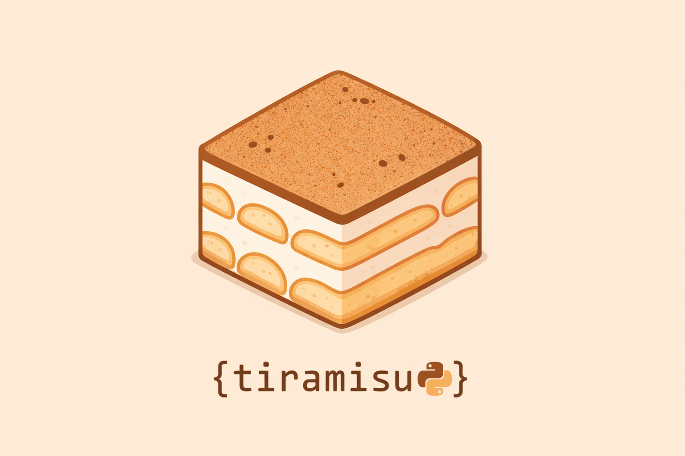

<p align="center">
  
</p>

<div align="center"> Sweet language based on Python 🤎. </div>

> [!IMPORTANT]
> This project is still in development.

## 🍩 О проекте

**Tiramisu** — это эзотерический язык-фреймворк, который превращает написание кода на Python в сладкое обилие десертов. 

Если [YoptaScript](https://github.com/samgozman/YoptaScript) переводил JS на язык гопников, то Tiramisu переводит Python на язык шеф-поваров и кондитеров. Сухой синтаксис заменён на "сладкие" термины, но под капотом работает всё тот же Python 🐍!

## ✨ Преимущества

* 🎨 **Осмысленный синтаксис** — почти все частоиспользуемые слова и конструкции Python переведены на "десертный" язык
* 🔥 **Переведённая обработка ошибок** — сообщения об ошибках также выводятся с использованием терминологии Tiramisu
* 🔗 **Полная совместимость** — внутри всё ещё настоящий Python, поэтому все библиотеки работают как обычно
* 🧩 **Поддержка модульности** — собственная система импортов (Import Hooks) позволяет делать `import` файла `.tira` внутри другого файла
* 📟 **Интерфейс командной строки** — имеется свой простой и удобный способ запуска рецептов (CLI)
* _список будет пополняться..._

## 👩‍🍳 Пример рецепта (Код)

<table>
  <!-- Строка с заголовками -->
  <tr>
    <th style="font-family: sans-serif">
      🐍 Python
    </th>
    <th style="font-family: sans-serif">
      🍰 Tiramisu
    </th>
  </tr>
  <!-- Строка с кодами -->
  <tr>
    <td>
      <pre lang="python"><code>import time
class Cake:
  def __init__(self, slices):
    self.slices = slices
  def eat(self):
    for i in range(self.slices):
      if self.slices > 0:
        print("Eating slice...")
      else:
        print("No cake left!")
    return True</code></pre>
    </td>
    <td>
      <pre lang="python"><code>order time
pie Cake:
  chef __init__(self, slices):
    self.slices = slices
  chef eat(self):
    treat i dip range(self.slices):
      taste self.slices > 0:
        bake("Eating slice...")
      aftertaste:
        bake("No cake left!")
    serve Yummy</code></pre>
    </td>
  </tr>
</table>

## 🚀 Как запустить

### Запуск с помощью командной строки
1. Соберите свой пакет инструмента с помощью
```bash
pip install -e .
```

2. Запустите свой рецепт с помощью
```bash
tiramisu run my_script.tira
```

### Запуск с помощью интерпретатора Python
```bash
python src/transpiler.py my_script.tira
```

## 🗺️ Roadmap

Проект активно готовится и обрастает новыми слоями, как настоящий парфе:

* [x] Обработка ошибок (Error Handling) — Самое важное уже работает, трейсбеки стали понятными и "сладкими"
* [x] Import Hooks: возможность напрямую импортировать .tira файлы внутри других скриптов
* [x] CLI (Интерфейс командной строки) — Удобный запуск через команду tiramisu run ...
* [ ] Интерактивная консоль (REPL) — Для быстрого запуска кода прямо в терминале
* [ ] Подсветка синтаксиса — Плагины для VS Code (Developer Experience)
* [ ] Тестирование и CI/CD — Чтобы рецепты не пригорали перед релизом
* [ ] Пакетная дистрибуция (PyPI) — pip install tiramisu
